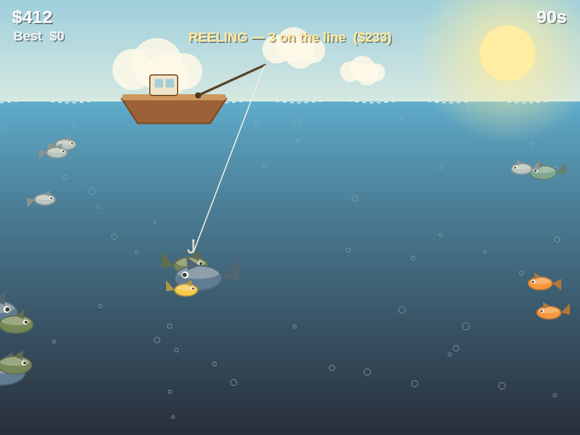

# 🎣 Reel Frenzy

A fast, polished arcade fishing game you can play **right in the browser**.
Cast deep, dodge the fish on the way down, then snag as many as you can on the
way up — chain catches for combo multipliers and chase a high score against a
90-second clock.

Built with the HTML5 **Canvas** and **Web Audio** APIs in plain JavaScript —
no framework, no build step, no assets. There's also a desktop **pygame**
version of the same game (see [below](#-desktop-version-pygame)).



## ▶️ Play it

It's a static site, so any of these work:

* **Just open it** — double-click `index.html` (runs straight from `file://`).
* **Serve it locally** — `python3 -m http.server` then visit
  <http://localhost:8000>.
* **Host it** — drop the repo on GitHub Pages / Netlify / any static host.
  Point it at the repo root; `index.html` is the entry point.

Works on desktop and mobile (with on-screen touch controls).

## The hook (literally)

The twist is the two-phase cast:

1. **Dive** – when you cast, the hook sinks. Steer **left / right** to *dodge*
   the fish. Touching a fish (or hitting the seabed) ends your descent, so a
   clean dive reaches the deeper, more valuable water.
2. **Reel** – on the way back up, steer *into* fish to hook them. Snag several
   in a single trip and they stack into a **combo multiplier**.

Deeper, rarer species are worth far more — and the elusive **Gold Koi** is the
big payday. You have 90 seconds. Make it count.

## Controls

| Input            | Action                              |
| ---------------- | ----------------------------------- |
| `SPACE` / `↑` / tap **CAST** | Cast, then start reeling early |
| `←` `→` / `A` `D` / ◀ ▶ buttons | Steer the hook            |
| Tap / click the water | Cast (also starts / restarts) |
| `P`              | Pause / resume                      |
| `R`              | Restart (on the game-over screen)   |

Your best score is saved in the browser (`localStorage`).

## Fish & payouts

| Species     | Value | Where it swims        |
| ----------- | ----- | --------------------- |
| Sardine     | $5    | shallow               |
| Mackerel    | $10   | shallow–mid           |
| Clownfish   | $18   | mid                   |
| Bass        | $28   | mid–deep              |
| Tuna        | $55   | deep                  |
| Anglerfish  | $95   | the deepest water     |
| Gold Koi    | $150  | rare, anywhere        |

Combo bonus: `+25%` per extra fish landed in the same trip.

## Project layout

```
index.html     # page + canvas + on-screen touch controls
style.css      # responsive page / canvas / button styling
game.js        # the whole game (logic, rendering, procedural audio)
fishing_game.py# the original desktop pygame version
```

## Headless smoke test

`game.js` doubles as a Node module and ships a headless self-test (a fake
canvas drives the full update/draw loop, no browser or audio needed):

```bash
node game.js --selftest 600
```

## 🖥️ Desktop version (pygame)

The original desktop build lives in `fishing_game.py`:

```bash
pip install -r requirements.txt   # pygame
python fishing_game.py
```

It has the same gameplay and a matching headless check:

```bash
python fishing_game.py --selftest 600
```

## Notes

* The art is drawn with canvas primitives and the sound effects are
  synthesized at runtime, so the web game is just three small static files.
* Tested with a native canvas renderer to confirm the visuals; the
  screenshot above is rendered straight from `game.js`.
