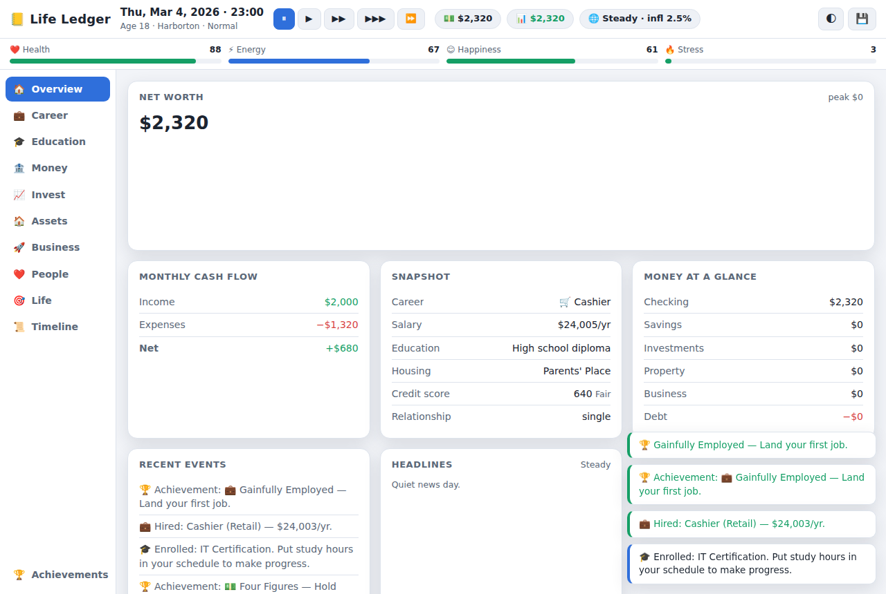

# 📒 Life Ledger

A browser-based **life & money simulation**. You start at 18 with pocket
change and build an entire life from scratch — career, education, a portfolio,
a business, real estate, relationships, a family — one decision at a time.
Every choice trades off money, time, health, happiness and long-term goals
against each other, and a living economy (inflation, interest rates, booms and
recessions) reacts underneath you.

It's a blend of *BitLife*, *The Sims* and a tycoon game, wrapped in a clean
financial dashboard — and it quietly teaches real personal-finance concepts
(compounding, credit, diversification, taxes, leverage) through play.



Built with plain **HTML, CSS and JavaScript** — no framework, no build step,
no assets. The simulation engine is completely decoupled from the DOM, so the
whole game also runs headless in Node.

## ▶️ Play it

It's a static site:

* **Just open it** — double-click `index.html` (runs straight from `file://`).
* **Serve it locally** — `python3 -m http.server` in this folder, then visit
  <http://localhost:8000>.
* **Host it** — drop the folder on GitHub Pages / Netlify / any static host.

Works on desktop and mobile, in light and dark themes. Progress autosaves to
your browser every in-game week.

## How to play

1. **Create a character** — name, starting city, difficulty, and up to three
   personality traits (each meaningfully changes the sim).
2. **Press play** and pick a speed (1 real second ≈ 2–128 in-game hours). Pause
   any time with `space`.
3. **Set your daily schedule** — you have 24 hours a day. Split them between
   sleep, work, study, exercise, socializing, a side hustle, running a
   business, and leisure. Over-book yourself and something gives.
4. **Make moves** across the tabs: enroll in school, apply for jobs, invest,
   buy property and vehicles, start a business, date, marry, raise kids, manage
   debt and taxes.
5. React to **random life events** — some are just flavor, some are decisions
   that pause the game and matter.
6. Chase **achievements** and a final **Legacy Score** when your run ends.

### Controls

| Input | Action |
| ----- | ------ |
| `space` | Pause / resume |
| `1` `2` `3` `4` | Speed: normal → ultra |
| Sidebar tabs | Switch dashboard sections |
| 🌓 / 💾 (top right) | Toggle theme · saves & new game |

## What's simulated

* **Economy** — cumulative inflation, a policy interest rate, boom / steady /
  recession regimes (a Markov chain), an unemployment rate and a housing index.
  Everything prices off these.
* **Markets** — 13 assets (funds, stocks, bonds, crypto) on a daily geometric
  random walk with per-asset drift & volatility, dividends, and live charts.
* **Careers** — 20+ career ladders, each with tiers, salary, promotion
  requirements (tenure + skills + performance), stress, layoffs during
  downturns, raises you negotiate, and interviews you can flunk.
* **Education** — certs, trade school, associate/bachelor/master/doctorate,
  each gating different careers. Knowledge and unused skills slowly decay.
* **Skills** — ten skills that improve only through practice, with diminishing
  returns and mood/energy modifiers.
* **Banking & credit** — checking, savings with interest, a credit card,
  loans (personal/auto/student/mortgage/business) with amortization, and a
  credit score that reacts to your behavior.
* **Real estate** — rent or buy homes and investment properties, with
  mortgages, property tax, maintenance, HOA, appreciation, rent and vacancies.
* **Business** — start one of eight business types, hire staff, set a marketing
  budget, watch quality/customers/profit evolve, then sell for a valuation.
* **Relationships & family** — dating, friendships, engagement, marriage,
  divorce, kids and pets, all of which need tending or drift away.
* **Health** — driven by diet, sleep, exercise, stress, insurance and age,
  with illnesses, medical bills and a mortality model.
* **Taxes** — progressive brackets plus payroll & state tax, capital gains,
  withholding, and an annual refund or bill.

Careers, businesses, assets, education, housing, vehicles, traits and
lifestyle options all live as **plain data** in `js/data.js` — you can add
content without touching the simulation code.

## Headless self-test

The engine is DOM-free, so the entire simulation runs in Node. The self-test
creates a character, plays several in-game years with a scripted "sensible
player," and asserts invariants (finite money, in-range stats, valid credit,
inflation sanity, a save/load round-trip, and deterministic replay for a fixed
seed):

```bash
node selftest.js 6      # simulate 6 in-game years (default)
node selftest.js 40     # a whole lifetime
```

## Project layout

```
index.html        # page shell: top bar, stat meters, sidebar, panel, overlay
style.css         # responsive, theme-aware dashboard styling
js/util.js        # seeded RNG, money/date formatting, math helpers
js/data.js        # all game content (careers, assets, education, …) as data
js/economy.js     # inflation, rates, regimes, housing index, daily market sim
js/state.js       # character creation, derived stats, trait mods, net worth
js/systems.js     # the gameplay systems (money, career, invest, business, …)
js/events.js      # random life events + achievements
js/engine.js      # the tick loop and daily/monthly/yearly processing
js/ui.js          # all DOM rendering and panel interaction
js/main.js        # game loop, character creator, save/load, input wiring
selftest.js       # headless multi-year simulation with invariant checks
```

## Notes

* Deterministic: the whole simulation is driven by one seeded RNG whose state
  is saved with the game, so a given seed replays identically.
* No external requests, no dependencies, no tracking — three folders of static
  files that run entirely in your browser.
